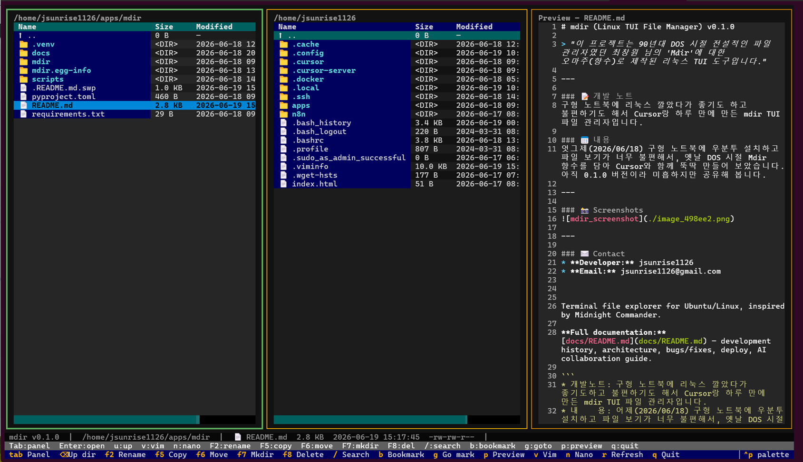

# mdir (Linux TUI File Manager) v0.1.0

> "이 프로젝트는 90년대 DOS 시절 전설적인 파일 관리자였던 최창원 님의 'Mdir'에 대한 오마주(향수)로 제작된 리눅스 TUI 도구입니다."

---

### 📝 개발 노트
구형 노트북에 리눅스 깔았다가 좋기도 하고 불편하기도 해서 Cursor랑 하루 만에 만든 mdir TUI 파일 관리자입니다.

### 📅 내용
엇그제(2026/06/18) 구형 노트북에 우분투 설치하고 파일 보기가 너무 불편해서, 옛날 DOS 시절 Mdir 향수를 담아 Cursor와 함께 뚝딱 만들어 보았습니다. 아직 0.1.0 버전이라 미흡하지만 공유해 봅니다.

---

### 📸 Screenshots


---

### ✉️ Contact
* **Developer:** jsunrise1126
* **Email:** jsunrise1126@gmail.com


Terminal file explorer for Ubuntu/Linux, inspired by Midnight Commander.

## Install

```bash
cd ~/apps/mdir

# If a previous .venv exists but has no activate script, remove it first:
# rm -rf .venv

# Ubuntu minimal installs often lack ensurepip; this still works:
python3 -m venv --without-pip .venv
source .venv/bin/activate
python -m pip install -r requirements.txt
```

If `python3 -m venv` itself fails, install the venv package once:

```bash
sudo apt install python3-venv python3-pip
```

Then recreate the environment:

```bash
rm -rf .venv
python3 -m venv .venv
source .venv/bin/activate
pip install -r requirements.txt
```

## Run

```bash
python -m mdir
python -m mdir ~/Downloads
```

## Keys

| Key | Action |
|-----|--------|
| Tab | Switch active panel |
| Enter | Open directory / file |
| u / Backspace | Parent directory |
| F2 | Rename |
| F5 | Copy to other panel |
| F6 | Move to other panel |
| F7 | New directory |
| F8 | Delete |
| / | Filter current panel |
| b | Bookmark menu |
| g | Go to bookmark |
| n | Edit with Nono Editor |
| p | Toggle preview pane |
| r | Refresh |
| v | Edit with Vim Editor |
| q | Quit |

Bookmarks are stored in `~/.config/mdir/bookmarks.json`.

The layout fills the terminal window and reflows when you resize it.
